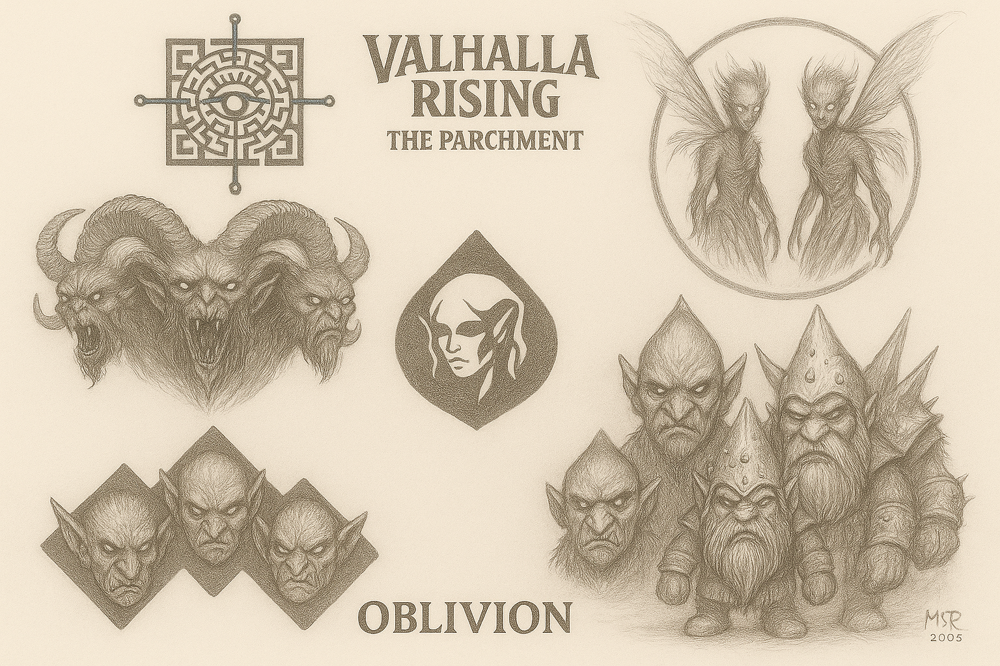

  

---

# 🌿 OBLIVION  
### 🇨🇦 EN-CA | 🇨🇦 FR-CA

## 🧩 Introduction (EN-CA)  
Oblivion is the primal jungle of Valhalla Rising — a domain ruled by ancient tribes and forgotten shadows.  
Its wilderness is not only a route, but a living being... chaotic, unpredictable, and full of secrets.

## 🧩 Introduction (FR-CA)  
Oblivion est la jungle primordiale de Valhalla Rising — un royaume régi par des tribus anciennes et des ombres oubliées.  
Cette nature sauvage n’est pas une simple route : c’est un être vivant, chaotique, imprévisible et riche en secrets.

---

## ✍️ Art & Lore  
This image represents the four main factions that inhabit the Oblivion jungle:  
- 🟠 **Ransor** of Muspelheim  
- 🟡 **Goblins** of Svartalfheim  
- 🔵 **Gnomes** of Alfheim (dark version)  
- 🟢 **Nymphs** of Helheim

Art by **MSP**, pencil on paper, 2005.

---
